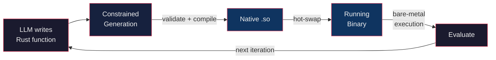

<p align="center">
  
</p>

# Symbiont Agent Harness

Agent harness for hot-reloading function evolution of Rust code.

LLMs write type-safe Rust functions that get natively compiled and hot-swapped into your running binary — bare-metal execution, zero interpreter overhead.

## How it works



You declare function signatures with the `evolvable!` macro.
At runtime, the harness prompts an LLM to implement them, then validates, compiles, and hot-swaps
the resulting native code into the running process — no restart required.

**Constrained generation** is what makes this reliable: the harness enforces that LLM output is valid Rust,
matches the declared function signature, and compiles successfully.
When any check fails, the specific error (parse failure, signature mismatch, or compiler diagnostics)
is appended to the prompt and the LLM retries automatically until it produces correct code.

## Quick start

```rust
symbiont::evolvable! {
    fn step(counter: &mut usize) {
        *counter += 1;  // default implementation, evolved by the LLM
    }
}

#[tokio::main]
async fn main() -> symbiont::Result<()> {
    let runtime = symbiont::Runtime::init(SYMBIONT_DECLS).await?;
    let agent = symbiont::inference::init_agent()?;
    let fn_sigs = runtime.fn_sigs();
    let base_prompt = format!(
        "Give a concise implementation for this function signature: ```{}```, \
        that increments the counter by a constant in the range (5..20). \
        Code Only",
        fn_sigs[0]
    );

    let mut counter = 0;
    loop {
        step(&mut counter);  // bare-metal: calls into the hot-loaded native dylib
        println!("counter: {counter}");

        if counter % 10 == 0 {
            // LLM rewrites the function, harness validates + compiles + hot-swaps
            runtime.evolve_with_backpressure(&agent, base_prompt).await?;
            // New Agent written code is available next time `step` is called and executed natively.
        }
    }
}
```

The example shows a basic counter function where the Agent evolves the implementation,
based on a user-defined prompt.
The compiled dylib (of the function) gets hot-swapped in the evaluation loop, achieving bare-metal performance.
This is agentic code mode in action.
The harness provides constrained generation and nudges the LLM prompt if necessary.


Set the following environment variables for your inference provider, or local server.

```sh
export API_KEY="your-api-key" # Can be left blank for local inference providers like `llama-cpp`.
export BASE_URL="http://your-inference-host:port/v1"
export MODEL="unsloth/Qwen3.6-35B-A3B-GGUF:UD-Q4_K_M" # Or any model of your choice.
cargo run -p counter-example
```


## Core highlights

- **Type-safe agentic code**: Agents express intent as Rust functions with enforced signatures.
- **Constrained generation**: Parse errors, signature mismatches, and compiler diagnostics steer the LLM until it produces valid code.
- **Hot-swap dylibs**: Functions are compiled to native shared libraries and swapped in-place via `libloading` — no process restart.
- **Bare-metal performance**: Evolved functions run as native compiled code with configurable optimization profiles.
- **Plug-in inference**: Any Inference provider via [rig](https://github.com/0xPlaygrounds/rig).

## Motivation

Current-generation Agent harnesses such as [Agentica](https://github.com/symbolica-ai/ARC-AGI-3-Agents) achieve SOTA
on complex long-running tasks like ARC-AGI-3 by providing a persistent Python REPL that the agent lives in.
This is known as **CodeMode** — it allows the agent to leverage the entire Python ecosystem natively, without MCP.

However, Python's interpreter overhead becomes the bottleneck for compute-heavy workloads.
If the agent's task is to optimize a well-typed function, evaluation in Python can be 10-100x slower than native execution,
directly limiting how many iterations the agent can explore in a given time budget.

Symbiont brings a similar agentic code evolution paradigm to Rust.
Agents write type-safe function bodies that get compiled to native code and hot-swapped into the running binary.
The Rust compiler enforces memory safety and type correctness,
while `symbiont`'s constrained generation loop ensures the LLM output always compiles before it reaches execution.

## Use cases

- Auto-research workflows with native-speed evaluation.
- Typed function body search (e.g., find an implementation that satisfies a test suite).
- Black-box optimization of inputs that produce desired outputs, e.g. Parameter Search.
- Self-evolving feature processing pipelines.
- Agentic code evolution generally.

## Limitations

These constraints arise from the binary/dylib interaction boundary. The harness mitigates most of them, but users should be aware:

- **Same toolchain required**: Rust has no stable ABI. The binary and dylib must be compiled with the same `rustc` version to guarantee matching calling conventions and memory layouts. The harness ensures this by compiling the dylib on the same machine with the same toolchain.
- **Primitive types only**: The generated dylib has no dependencies, so evolvable function signatures are limited to `std` types (`usize`, `f64`, `&[u8]`, etc.). Custom types across the boundary will require shared dependency support (not yet implemented).
- **`unsafe` at the boundary**: Dynamic symbol lookup is inherently `unsafe`. The harness validates function signatures against the `evolvable!` declaration and only loads code that parses, type-checks, and compiles — but the `extern "Rust"` pointer cast remains an unsafe invariant.

## License

Copyright (C) 2026 MathisWellmann

This program is free software: you can redistribute it and/or modify
it under the terms of the GNU Affero General Public License as published
by the Free Software Foundation, either version 3 of the License, or
(at your option) any later version.

This program is distributed in the hope that it will be useful,
but WITHOUT ANY WARRANTY; without even the implied warranty of
MERCHANTABILITY or FITNESS FOR A PARTICULAR PURPOSE.  See the
GNU Affero General Public License for more details.

You should have received a copy of the GNU Affero General Public License
along with this program.  If not, see <https://www.gnu.org/licenses/>.
