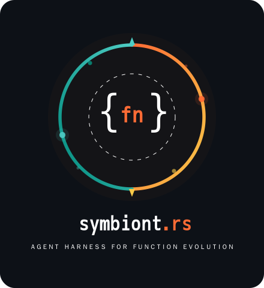
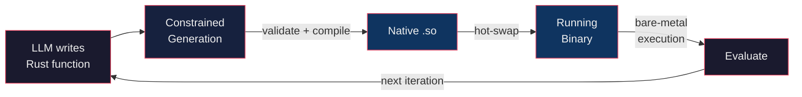

# Symbiont Agent Harness

<p align="center">
  
</p>


A model harness for enabling hot-reloading function evolution in Rust.

LLMs write type-safe Rust function bodies that get compiled natively and hot-swapped into your running binary — bare-metal execution, zero interpreter overhead.

## How it works



You declare function signatures with the `evolvable!` macro.
At runtime, the harness prompts an LLM to implement them, then validates, compiles, and hot-swaps
the resulting native code into the running process — no restart required.

**Constrained generation** is what makes this reliable: the harness enforces that LLM output is valid Rust,
matches the declared function signature, and compiles successfully.
When any check fails, the specific error (parse failure, signature mismatch, or compiler diagnostics)
is appended to the prompt and the LLM retries automatically until it produces correct code.

## Quick start

```rust
symbiont::evolvable! {
    fn step(counter: &mut usize) {
        *counter += 1;  // default implementation, evolved by the LLM
    }
}

#[tokio::main]
async fn main() -> symbiont::Result<()> {
    let runtime = symbiont::Runtime::init(SYMBIONT_DECLS).await?;
    let agent = symbiont::inference::init_agent()?;
    let fn_sigs = runtime.fn_sigs();
    let base_prompt = format!(
        "Give a concise implementation for this function signature: ```{}```, \
        that increments the counter by a constant in the range (5..20). \
        Give Rust Code Only.",
        fn_sigs[0]
    );

    let mut counter = 0;
    let mut last_evolution = std::time::Instant::now();
    loop {
        step(&mut counter);  // bare-metal: calls into the hot-loaded native dylib
        println!("counter: {counter}");

        if last_evolution.elapsed() >= std::time::Duration::from_secs(10) {
            // LLM rewrites the function, harness validates + compiles + hot-swaps
            runtime.evolve(&agent, &base_prompt).await?;
            last_evolution = std::time::Instant::now();
            // New Agent written code is available next time `step` is called and executed natively.
        }
    }
}
```

The example shows a basic counter function where the Agent evolves the implementation,
based on a user-defined prompt.
The compiled dylib (of the function) gets hot-swapped in the evaluation loop, achieving bare-metal performance.
This is agentic code mode in action.
The harness provides constrained generation and nudges the LLM prompt if necessary.

See the [Development setup](#development-setup) section and the `examples/` directory for more.

## Core highlights

- **Type-safe agentic code**:
  Agents express intent as Rust functions with enforced signatures.
- **Constrained generation**:
  Parse errors, signature mismatches, and compiler diagnostics steer the LLM until it produces valid code.
- **Hot-swap dylibs**:
  Functions are compiled to native shared libraries and swapped in-place via `libloading` — no process restart.
- **Bare-metal performance**:
  Evolved functions run as native compiled code.
  The dispatch overhead is **~1 ns per call** (a single atomic pointer load + indirect call).
  The hot path is fully lock-free and multi-thread safe.
- **Plug-in inference**:
  Any Inference provider is supported via [rig](https://github.com/0xPlaygrounds/rig).
- **Tiny Core**:
  Only ~1000 LOC for the Agent harness and constrained generation part.
- **Catches Agent Code Panics***
  Any LLM code that generate a runtime panic will be caught using `catch_unwind`, and the panic message is used
  to provide backpressure in the prompt. See [unwind.rs](symbiont/src/unwind.rs) for details.

## Motivation

Current-generation Agent harnesses such as [Agentica](https://github.com/symbolica-ai/ARC-AGI-3-Agents) achieve SOTA
on complex long-running tasks like ARC-AGI-3 by providing a persistent Python REPL that the agent lives in.
This is known as **CodeMode** — it allows the agent to leverage the entire Python ecosystem natively, without MCP.

However, Python's interpreter overhead becomes the bottleneck for compute-heavy workloads.
If the agent's task is to optimize a well-typed function, evaluation in Python can be 10-100x slower than native execution,
directly limiting how many iterations the agent can explore in a given time budget.

Symbiont brings a similar agentic code evolution paradigm to Rust.
Agents write type-safe function bodies that get compiled to native code and hot-swapped into the running binary.
The Rust compiler enforces memory safety and type correctness,
while `symbiont`'s constrained generation loop ensures the LLM output always compiles before it reaches execution.

## Use cases

- Typed function body search (e.g., find an implementation that satisfies a test suite).
  - See [fizzbuzz-example](examples/fizzbuzz/src/main.rs)
  - See [rastrigin-example](examples/rastrigin/src/main.rs)
- Performance Optimization under functional equivalence
  - See [sort-example](examples/sort/src/main.rs)
- Auto-research workflows with native-speed evaluation.
- Black-box optimization of inputs that produce desired outputs, e.g. Parameter Search.
- Self-evolving feature processing pipelines.
- Agentic code evolution generally.

## Development setup

The project uses [Nix](https://nixos.org/) for reproducible builds and [devenv](https://devenv.sh/) to manage a local inference server.

**Prerequisites**: Nix with flakes enabled.

Setup your `.env` file like this for the next steps (or use your desired inference provider):
```sh
export API_KEY=""
export BASE_URL="http://127.0.0.1:8321/v1"
export MODEL="google/gemma-4-E2B-it"
```

Then execute the following:
```sh
# Enter the development shell (provides Rust nightly, cargo tools, formatters)
nix develop

# Start a local llama-cpp server with gemma-4-E2B-it (auto-downloads on first run)
devenv up

# In another terminal, run the counter example
cargo run -p counter-example
```

## Dispatch overhead

Function pointers are cached in `AtomicPtr` statics after each load — callers never touch a lock or perform a symbol lookup.

|                       | Time per call |
|-----------------------|---------------|
| Direct function call  | 0.91 ns       |
| `evolvable!` dispatch | 1.64 ns       |

Benchmark: `cargo bench -p symbiont --bench dispatch_overhead`

On reload, the runtime updates the atomic pointers and drops the old library.
This is safe because the feedback loop contract guarantees no evolvable functions are executing during evolution — only one `.so` is loaded at any time.

## Per-evolution timings

A typical evolution cycle (LLM inference → constrained generation → compilation -> fn evaluation) highly depends on:
- The model being used (Inference latency)
- Size of the generated Rust code.
- Optimization level for the compiled dylib.
- Did the LLM make a misstake? -> Repeat cycle again with new steering prompt.

Example timings for `fizzbuzz-example` using `unsloth/Qwen3.6-35B-A3B-GGUF:UD-Q4_K_M` on an RTX Pro 6000 Blackwell and `llama-cpp` (~150TPS):
| Stage          | Time    |
|----------------|---------|
| LLM inference  | 4852 ms |
| Harness checks | 0 ms    |
| Compilation    | 118 ms  |
| Function Eval  | <3ns    |

The function evaluation pipeline should be built to keep these proportions in mind.
The `fizzbuzz-example` can be oneshot and function evaluation is super cheap, so its not representative, just a toy example.

## Limitations

These constraints arise from the binary/dylib interaction boundary. The harness mitigates most of them, but users should be aware:

- **Static function signatures**:
  The LLM can only rewrite function *bodies* — the signature declared in `evolvable!` is fixed at compile time and enforced on every evolution.
  This is by design (it's what makes constrained generation possible), but it means the agent cannot add parameters, change return types, or introduce new functions at runtime.
  It would be UB to hot-swap a different function signature in, when the main binary expects a certain memory layout.
- **Sequential feedback loop**:
  All evolvable function calls must have returned before `evolve()` is called. The old library is dropped on reload, so in-flight calls through stale pointers would be UB.
  This matches the intended usage pattern (run functions, collect results, evolve, repeat) and is enforced with an assertion in debug builds at zero cost in release.
  Multi-threading is possible, but requires extra care.
- **Same toolchain required**:
  Rust has no stable ABI. The binary and dylib must be compiled with the same `rustc` version to guarantee matching calling conventions and memory layouts. The harness ensures this by compiling the dylib on the same machine with the same toolchain.
- **Primitive types only**:
  The generated dylib has no dependencies, so evolvable function signatures are limited to `std` types (`usize`, `f64`, `&[u8]`, etc.). Custom types across the boundary will require shared dependency support (not yet implemented).
- **`unsafe` at the boundary**:
  Dynamic symbol lookup is inherently `unsafe`. The harness validates function signatures against the `evolvable!` declaration and only loads code that parses, type-checks, and compiles — but the `extern "Rust"` pointer cast remains an unsafe invariant.

See [CAVEATS.md](CAVEATS.md) for more details.

## See also:

- [slopc](https://github.com/shorwood/slopc) for function body implementations at compile time, but no evolution or feedback cycles there.
- [hot-lib-reloader](https://github.com/rksm/hot-lib-reloader-rs) for the idea of hot-swapping functions at runtime.
- [GEPA](https://github.com/gepa-ai/gepa)  for optimizing any system with textual parameters against any evaluation metric. But not Rust :(
- [Agentica](https://github.com/symbolica-ai/agentica-python-sdk) for a Python Agent SDK, providing persistent REPL and sub-agents.

Also **checkout** the [TODOs](TODO.md) file for what might come next for `symbiont`. Stay tuned!

## License

Copyright (C) 2026 MathisWellmann

This project is licensed under the **Mozilla Public License 2.0** — see [LICENSE](LICENSE) for details.
