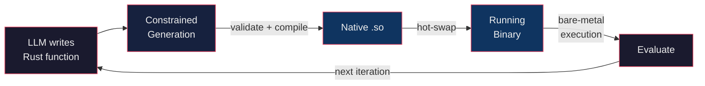

# Symbiont
A Rust native Agent harness where models write type-safe function implementations
as dynamic libraries that get hot-swapped by the harness to enable agentic code evolution.
It enables fast-iteration cycles in agentic auto-research tasks such a function optimization or black-box parameter search.

## How it works

## Core highlights:
- Agents express intent as type-safe Rust code.
- Constrained code generation with harness-enforced rules.
- In-place evolution of functions through [hot-reloading dylibs](https://github.com/rksm/hot-lib-reloader-rs)
- Bare metal function execution performance (configurable optimization profile)
- Plug-in Inference provider support, using [rig](https://github.com/0xPlaygrounds/rig)

## Motivation
Current generation agent harnesses such as [Agentica](https://github.com/symbolica-ai/ARC-AGI-3-Agents) achive SOTA
on complex long-running tasks such as ARG-AGI-3.
This is achieved by providing a persistent Python REPL that the Agent lives in and its able to spawn sub-agents too.
This allows it to leverage the entire Python ecosystem worth of packages that the Agent has native support for
without the need for MCP (Model Context Protocol).
This is known as CodeMode.
Agentica and similar agent harnesses require a dynamic interpreter and an interactive REPL,
which Rust does not natvely offer due to its design decisions.
Agentica uses Python, which has low performance and high Interpreter overhead, which becomes the major bottleneck for compute-heavy workloads,
and fast agentic feedback cycles.
If the Agent task is to optimize a well-typed function, it might take 10-100 times longer for it to find the correct solution given the slow nature of function evaluation.

Symbionts (Agents built on `symbiont`) reach bare-metal performance by leveraging the excellent performance
and memory-safety guarantees offered by the Rust compiler and its ecosystem.

## Use cases
- Auto-research workflows.
- Typed Function Body implementation search.
- Black-box optimization of inputs that produce the desired outputs.
- Self evolving feature processing pipelines.
- Agentic code evolution generally.
- Do you even need more?

## License
Copyright (C) 2026 MathisWellmann

This program is free software: you can redistribute it and/or modify
it under the terms of the GNU Affero General Public License as published
by the Free Software Foundation, either version 3 of the License, or
(at your option) any later version.

This program is distributed in the hope that it will be useful,
but WITHOUT ANY WARRANTY; without even the implied warranty of
MERCHANTABILITY or FITNESS FOR A PARTICULAR PURPOSE.  See the
GNU Affero General Public License for more details.

You should have received a copy of the GNU Affero General Public License
along with this program.  If not, see <https://www.gnu.org/licenses/>.
