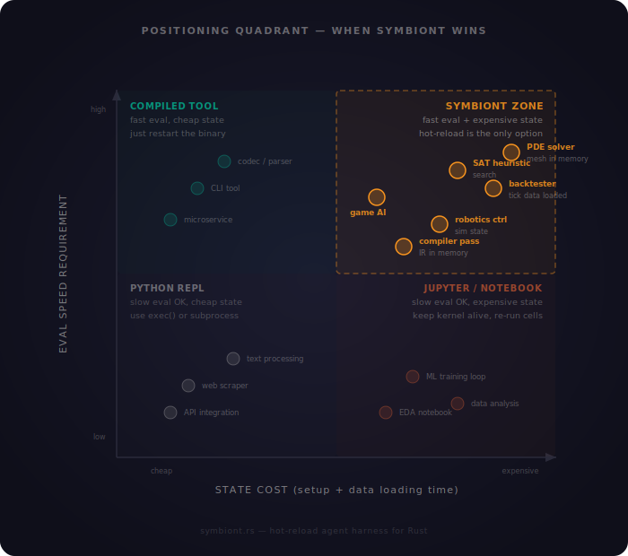

# Symbiont Agent Harness

<p align="center">
  
</p>


An agentic feedback loop that evolves Rust functions: an LLM generates type-safe code, the harness compiles and hot-swaps it into your running binary, evaluates the results, and feeds performance back to the LLM for the next iteration — bare-metal execution, zero interpreter overhead.

## How it works


Declare function signatures with the `evolvable!` macro and provide an evaluation function.
The agent autonomously implements, and refines the code each iteration — the harness
validates, compiles, and hot-swaps the native code into the running process without a restart.

**Constrained generation** is what makes this reliable: the harness enforces that LLM output is valid Rust,
matches the declared function signature, and compiles successfully.
When any check fails, the specific error (parse failure, signature mismatch, or compiler diagnostics)
is appended to the prompt and the LLM retries automatically until it produces correct code.

## Quick start

```rust,ignore
symbiont::evolvable! {
    fn step(counter: &mut usize) {
        // default implementation body, entirely evolved by the LLM
        *counter += 1;
        println!("doing stuff in iteration {}", counter);
    }
}

#[tokio::main]
async fn main() -> symbiont::Result<()> {
    let runtime = symbiont::Runtime::new(SYMBIONT_DECLS, SYMBIONT_PRELUDE, symbiont::Profile::Debug).await?;
    let agent = symbiont::inference::init_agent(None)?;
    let fn_sigs = runtime.fn_sigs();
    let base_prompt = format!(
        "Give a concise implementation for this function signature: ```{}```, \
        that increments the counter by a constant in the range (5..20). \
        Give Rust Code Only.",
        fn_sigs[0]
    );

    let mut counter = 0;
    let mut last_evolution = std::time::Instant::now();
    loop {
        step(&mut counter);  // bare-metal: calls into the hot-loaded native dylib
        println!("counter: {counter}");

        if last_evolution.elapsed() >= std::time::Duration::from_secs(10) {
            // LLM rewrites the function, harness validates + compiles + hot-swaps
            runtime.evolve(&agent, &base_prompt).await?;
            last_evolution = std::time::Instant::now();
            // New Agent written code is available next time `step` is called and executed natively.
        }
    }
}
```

The example shows a basic counter function where the Agent evolves the implementation,
based on a user-defined prompt.
The compiled dylib (of the function) gets hot-swapped in the evaluation loop, achieving bare-metal performance.
This is agentic code mode in action.
The harness provides constrained generation and nudges the LLM prompt if necessary.

<p align="center" width="100%">
<video src="https://github.com/user-attachments/assets/632078d0-4789-4214-af21-2f86ca250ae4" width="80%" controls></video>
</p>

See the [Development setup](#development-setup) section and the `examples/` directory for more.

## Showcase: evolving a trading strategy

The [evolving-trader-example](examples/evolving-trader/README.md) is the most complete demonstration of what symbiont can do.
An LLM evolves a futures **trading strategy** as compiled Rust against a realistic exchange simulation:

- ~1M raw BitMEX XBTUSD trades are aggregated into information-driven **volume candles** with [trade_aggregation](https://crates.io/crates/trade_aggregation).
- Executions are simulated with the leveraged futures exchange [lfest](https://crates.io/crates/lfest) — taker fees, bid-ask spread and margin requirements included.
- The evolvable `fn decide(candles: &[Candle], account: &AccountState) -> Action` receives a sliding window of candles plus the account state and returns a market-order action.
- Each round, the backtest report (return, buy & hold benchmark, drawdown, Sharpe, fees, rejected orders) is fed back to the LLM; the best strategy is evaluated on a **held-out test segment** it has never seen.

The LLM must discover features (momentum, volatility, order flow), position sizing and fee-awareness — quantitative reasoning expressed as hot-swapped native code.

```bash
cargo run -p evolving-trader-example
```

## Showcase: evolving a live fractal shader

The [fractal-studio-example](examples/fractal-studio/README.md) is an interactive egui window whose **per-pixel shader is written by the LLM** and hot-swapped into the running binary as optimized native code.
Type a prompt — *"an animated Julia set, c orbiting the main cardioid, with a glowing sunset palette"* — and the agent implements `fn shade(x: f64, y: f64, t: f64) -> u32`; the live animation morphs in place, no restart:

<p align="center" width="100%">
<video src="https://github.com/user-attachments/assets/1527ea1d-decd-46a4-9687-5189cac16bd9" width="80%" controls></video>
</p>

- `shade` is called once per pixel (~0.5M calls/frame at 960×540), parallelized over all cores with rayon — an interpreted agent-code loop would be orders of magnitude too slow to animate.
- The user is the evaluator: the runtime keeps the chat history, so follow-up prompts refine the current shader.
- Agent code panics are caught inside the dylib (rendered as black pixels) and fed back into the next evolution prompt.

```bash
cargo run -p fractal-studio-example --release
```

## Core highlights

- **Type-safe agentic code**:
  Agents express intent as Rust functions with enforced signatures.
- **Constrained generation**:
  Parse errors, signature mismatches, and compiler diagnostics steer the LLM until it produces valid code.
- **Hot-swap dylibs**:
  Functions are compiled to native shared libraries and swapped in-place via `libloading` — no process restart.
- **Revision registry**:
  Every successfully hot-swapped dylib stays loaded and is addressable as a `Revision`.
  `evolve()` returns the new revision's id, and `activate_revision` rolls the process back to
  any earlier implementation with a few atomic pointer stores — no re-parsing, no recompilation.
- **Typed revision handles**:
  `evolvable!` also generates `<name>_fn(revision)` accessors returning a typed `RevisionFn`
  pinned to any retained revision. Run several evolved implementations concurrently —
  ensembles, tournaments, A/B comparisons — or mix functions from different revisions;
  handle calls dispatch at active-pointer speed.
  See the [evolving-trader-example](examples/evolving-trader/README.md)'s top-3 ensemble.
- **Bare-metal performance**:
  Evolved functions run as native compiled code.
  The dispatch overhead is **~1 ns per call** (a single atomic pointer load + indirect call).
  The hot path is fully lock-free and multi-thread safe.
- **Observability**:
  Metrics for evolution attempts, failures, LLM usage, pipeline timings, revisions, and dylib sizes use the [`metrics`](https://crates.io/crates/metrics) facade. Enable the `prometheus` feature and call `observability::init_observability` to expose them.
- **Plug-in inference**:
  Any Inference provider is supported via [rig](https://github.com/0xPlaygrounds/rig).
- **Tool calling**:
  Register any rig `Tool` on the agent and it becomes available during evolution — rig drives the multi-turn tool-calling loop internally while the harness consumes only the final code.
  This lets the agent gather information (run tests, probe black-box systems, query data) before committing to an implementation.
  See the [tool-calling-example](examples/tool-calling/src/main.rs).
- **Tiny Core**:
  Only ~1000 LOC for the Agent harness and constrained generation part.
- **Catches Agent Code Panics**
  Any LLM code that generate a runtime panic will be caught using `catch_unwind`, and the panic message is used
  to provide backpressure in the prompt. See [unwind.rs](symbiont/src/unwind.rs) for details.

## When Symbiont wins

<p align="center">
  
</p>

## Use cases

- Quantitative strategy evolution against a realistic market simulation.
  - See [evolving-trader-example](examples/evolving-trader/README.md)
- Typed function body search (e.g., find an implementation that satisfies a test suite).
  - See [fizzbuzz-example](examples/fizzbuzz/README.md)
  - See [rastrigin-example](examples/rastrigin/README.md)
- Performance Optimization under functional equivalence
  - See [sort-example](examples/sort/README.md)
- Game AI / strategic reasoning through evolved code
  - See [tictactoe-example](examples/tictactoe/README.md)
- Interactive, human-in-the-loop visual evolution where the user is the evaluator.
  - See [fractal-studio-example](examples/fractal-studio/README.md)
- Tool-augmented evolution, where the agent must discover the specification through tool calls before writing code.
  - See [tool-calling-example](examples/tool-calling/src/main.rs)
- Auto-research workflows with native-speed evaluation.
  - See [quatize-example](examples/quantize/README.md)
- Black-box optimization of inputs that produce desired outputs, e.g. Parameter Search.
- Self-evolving feature processing pipelines.
- Agentic code evolution generally.

## Development setup

The project uses [Nix](https://nixos.org/) for reproducible builds and [devenv](https://devenv.sh/) to manage a local inference server.

**Prerequisites**: Nix with flakes enabled.

Setup your `.env` file like this for the next steps (or use your desired inference provider):
```sh
export API_KEY=""
export BASE_URL="http://127.0.0.1:8321/v1"
export MODEL="google/gemma-4-E2B-it"
```

Then execute the following:
```sh
# Enter the development shell (provides Rust nightly, cargo tools, formatters)
nix develop

# Start a local llama-cpp server with gemma-4-E2B-it (auto-downloads on first run)
devenv up

# In another terminal, run the counter example
cargo run -p counter-example
```

## Dispatch overhead

Function pointers are cached in `AtomicPtr` statics after each load — callers never touch a lock or perform a symbol lookup.
A `RevisionFn` handle goes one step further: it hoists its revision's function pointer once (`handle.get()`), so per-call dispatch skips even the atomic load.

|                          | Time per call |
|--------------------------|---------------|
| Direct function call     | 0.94 ns       |
| `evolvable!` dispatch    | 1.50 ns       |
| `RevisionFn` handle call | 1.47 ns       |

Benchmark: `cargo bench -p symbiont --bench dispatch_overhead` (dylib compiled with `Profile::Release`)

On reload, the runtime updates the atomic pointers and retains the old library in the revision registry (keep-all).
Earlier revisions therefore stay callable: `activate_revision` re-publishes their cached pointers without touching the compiler.
The feedback loop contract still guarantees no evolvable functions are executing while the pointers are swapped.

## Per-evolution timings

A typical evolution cycle (LLM inference → constrained generation → compilation -> fn evaluation) highly depends on:
- The model being used (Inference latency)
- Size of the generated Rust code.
- Optimization level for the compiled dylib.
- Did the LLM make a misstake? -> Repeat cycle again with new steering prompt.

Example timings for `fizzbuzz-example` using `unsloth/Qwen3.6-35B-A3B-GGUF:UD-Q4_K_M` on an RTX Pro 6000 Blackwell and `llama-cpp` (~150TPS):
| Stage          | Time    |
|----------------|---------|
| LLM inference  | 4852 ms |
| Harness checks | 0 ms    |
| Compilation    | 118 ms  |
| Function Eval  | <3ns    |

The function evaluation pipeline should be built to keep these proportions in mind.
The `fizzbuzz-example` can be oneshot and function evaluation is super cheap, so its not representative, just a toy example.

## Limitations

These constraints arise from the binary/dylib interaction boundary. The harness mitigates most of them, but users should be aware:

- **Static function signatures**:
  The LLM can only rewrite function *bodies* — the signature declared in `evolvable!` is fixed at compile time and enforced on every evolution.
  This is by design (it's what makes constrained generation possible), but it means the agent cannot add parameters, change return types, or introduce new functions at runtime.
  It would be UB to hot-swap a different function signature in, when the main binary expects a certain memory layout.
- **Sequential feedback loop**:
  All evolvable function calls must have returned before `evolve()` or `activate_revision()` is called.
  Retained revisions are never unmapped, so a violating in-flight call executes stale but still-mapped code rather than UB — the contract remains so a swap cannot publish a torn set of pointers from two different revisions.
  This matches the intended usage pattern (run functions, collect results, evolve, repeat) and is enforced with an assertion in debug builds at zero cost in release.
  Calls through `RevisionFn` handles are exempt: they pin their revision and never read the swapped pointers, so they may run concurrently with `evolve()` / `activate_revision()` and with each other.
  Multi-threading is possible, but requires extra care.
- **Same toolchain required**:
  Rust has no stable ABI. The binary and dylib must be compiled with the same `rustc` version to guarantee matching calling conventions and memory layouts. The harness ensures this by compiling the dylib on the same machine with the same toolchain.
- **Shared API crates for custom types**:
  Evolvable signatures may use custom or upstream dependency types when the generated dylib is configured with matching Cargo dependencies. For single-package applications, move boundary types and methods into the package library target, re-export them from `prelude`, and initialize with `DylibConfig::host_package(...)` so the dylib depends on the host crate as `host` and imports `host::prelude::*`.
- **`unsafe` at the boundary**:
  Dynamic symbol lookup is inherently `unsafe`. The harness validates function signatures against the `evolvable!` declaration and only loads code that parses, type-checks, and compiles — but the `extern "Rust"` pointer cast remains an unsafe invariant.

See [CAVEATS.md](CAVEATS.md) for more details.

## See also:

- [slopc](https://github.com/shorwood/slopc) for function body implementations at compile time, but no evolution or feedback cycles there.
- [hot-lib-reloader](https://github.com/rksm/hot-lib-reloader-rs) for the idea of hot-swapping functions at runtime.
- [GEPA](https://github.com/gepa-ai/gepa)  for optimizing any system with textual parameters against any evaluation metric. But not Rust :(
- [Agentica](https://github.com/symbolica-ai/agentica-python-sdk) for a Python Agent SDK, providing persistent REPL and sub-agents.

Also **checkout** the [TODOs](TODO.md) file for what might come next for `symbiont`. Stay tuned!

## License

Copyright (C) 2026 MathisWellmann

This project is licensed under the **Mozilla Public License 2.0** — see [LICENSE](LICENSE) for details
