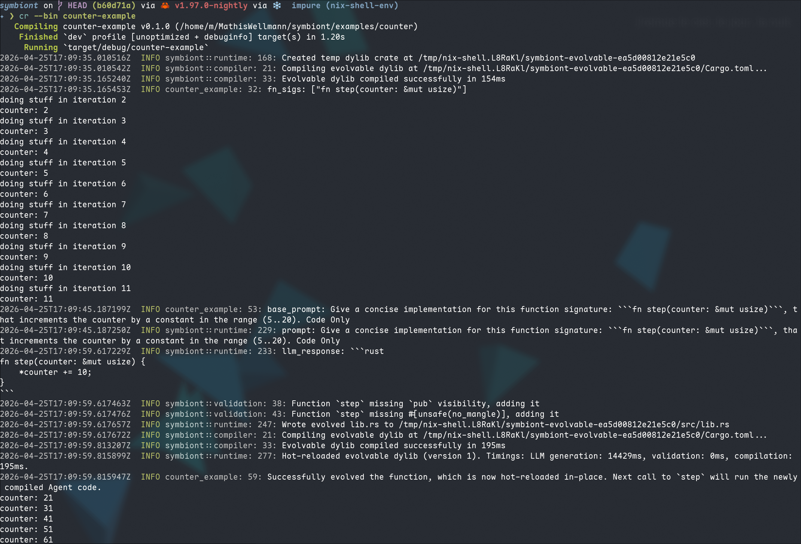

# Counter — Basic Hot-Reload Example

The simplest symbiont example: a `step(counter: &mut usize)` function that
mutates a counter in a loop. Every 10 seconds the harness asks the LLM to
produce a new implementation that increments the counter by a random constant
in the range 5..20, then hot-swaps the compiled dylib in-place.

This demonstrates the core feedback loop:

1. Call the evolvable function at bare-metal speed.
2. Prompt the LLM for a new implementation.
3. The harness validates, compiles, and hot-swaps the code.
4. The next call to `step` runs the newly generated code — no restart needed.

## Running

```bash
# Requires API_KEY, BASE_URL, and MODEL env vars (or a local llama-cpp server).
cargo run -p counter-example
```

The example runs indefinitely. Press `Ctrl+C` to stop.

## Solution


