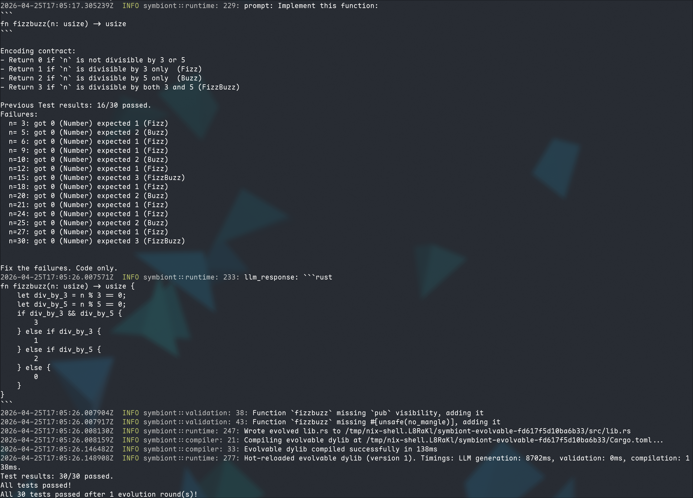

# FizzBuzz — Test-Driven Evolution Example

This example demonstrates test-driven function evolution: the LLM must produce
code that satisfies a test suite.

An evolvable `fizzbuzz(n: usize) -> usize` function classifies numbers by
divisibility, returning an encoded result:

| Code | Meaning                              |
|------|--------------------------------------|
| 0    | Not divisible by 3 or 5              |
| 1    | Fizz — divisible by 3 only           |
| 2    | Buzz — divisible by 5 only           |
| 3    | FizzBuzz — divisible by both 3 and 5 |

The default implementation is intentionally wrong (always returns 0). Each round
the harness runs the function against inputs 1..=30, collects pass/fail results
with concrete failure details (`n=5: got 0 (Number) expected 2 (Buzz)`), and
feeds them back to the LLM. The constrained-generation loop handles compilation
errors automatically via backpressure, while the test report closes the semantic
feedback loop.

## Running

```bash
# Requires API_KEY, BASE_URL, and MODEL env vars (or a local llama-cpp server).
cargo run -p fizzbuzz-example
```

## Solution

The LLM produced a correct implementation in 1 evolution round:


