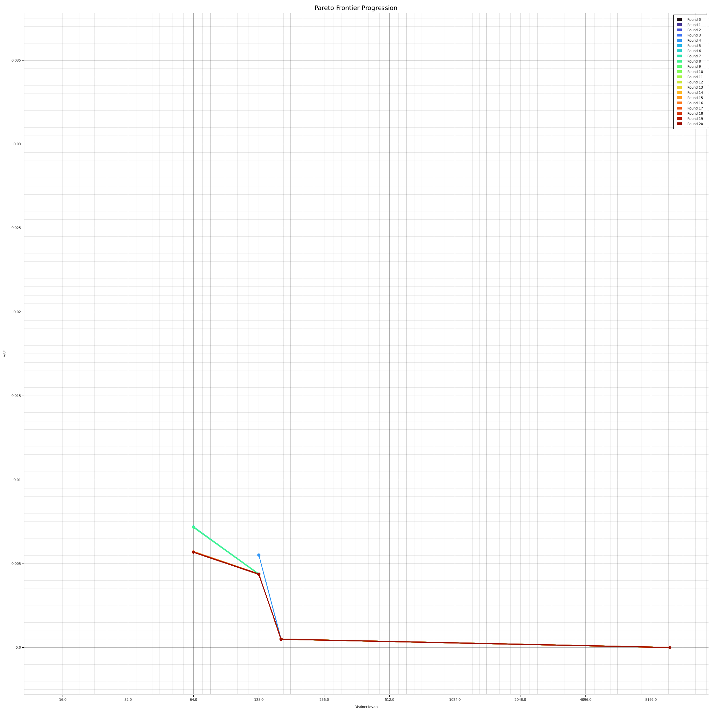

# Quantize Example

Optimal quantization via LLM-driven agentic search.
The LLM must implement a function that quantizes `f64` values into fewer
distinct levels, minimizing reconstruction error (MSE) while using as few
distinct output values as possible.

## How it works

1. An evolvable `fn quantize(input: &[f64], len: usize, output: &mut [f64])`
   function starts as an identity copy — perfect fidelity, zero compression.
2. Each round the LLM receives the function signature, the current Pareto
   frontier (with the source code that produced each point), and the last
   attempt's result.
3. The runtime compiles the new implementation into a shared library in `--release` mode and
   hot-swaps it in, then evaluates MSE and distinct-level count on fixed
   test data, which is a laplacian distribution, samples 10_000 times, just to make it interesting.
4. Non-dominated (num_levels, MSE) pairs are tracked on a Pareto frontier
   that grows across rounds.

The prompt is structured into clear sections (Task, Constraints, Goal,
Current Frontier, Last Attempt, Direction) so the LLM can make informed
trade-offs rather than searching blindly.

## Running

```sh
cargo run -p quantize-example
```

Requires `API_KEY`, `BASE_URL`, and `MODEL` environment variables (or a
`.env` file) for the LLM backend.

## Possible Improvements (Left as an excercise to the reader):
- Compare against some baseline algorithms (Uniform, Symmetric, Asymmetric, etc, who knows)
- Run on different input distributions to get specialized schemes.
- Prompting changes / context engineering might help the Agent reach better implementations.
- Try different SOTA models.  `unsloth/Qwen3.6-35B-A3B-GGUF:UD-Q4_K_M` might be sub-optimal here.
- Run for more than 20 generations.
- Store the pareto frontier code somewhere for later retrieval (Not just printing it to stdout.)
- More rigorous evaluation procedure (Runtime is dominated by inference latency).
- Better progression plots, etc.

## Pareto frontier progression

The plot below shows how the frontier evolves over 20 rounds on a Laplacian
distribution with 10,000 samples. Each coloured line is the frontier snapshot
after that round. The x-axis (log2) is the number of distinct output levels;
the y-axis is MSE.
Model used is `unsloth/Qwen3.6-35B-A3B-GGUF:UD-Q4_K_M` running with `llama-cpp` on an `RTX Pro 6000 Blackwell (96GB)`


## Another Run (color, prompting and model change)

Now with `unsloth/Qwen3.6-27B-GGUF:BF16`



### Output:

Evolution complete after 20 rounds.
Final aggregate Pareto frontier:
Laplacian frontier:
| Distinct levels | Bits/value | MSE        | Round |
|-----------------|------------|------------|-------|
|              64 |        6.0 |  5.6879e-3 |    18 |
|             128 |        7.0 |  4.3793e-3 |     5 |
|             162 |        8.0 |  5.0992e-4 |     3 |
|           10000 |       14.0 |   0.0000e0 |     0 |

Last implementation:
```rust
#[unsafe(no_mangle)]
pub fn quantize(input: &[f64], len: usize, output: &mut [f64]) {
    if len == 0 {
        return;
    }
    if len == 1 {
        output[0] = input[0];
        return;
    }
    let mut data: Vec<(f64, usize)> = input
        .iter()
        .take(len)
        .enumerate()
        .map(|(i, &v)| (v, i))
        .collect();
    data.sort_by(|a, b| a.0.partial_cmp(&b.0).unwrap_or(std::cmp::Ordering::Equal));
    let k = 64;
    let k = if len < k { len } else { k };
    if k <= 1 {
        let mean = data.iter().map(|&(v, _)| v).sum::<f64>() / len as f64;
        for &(_, idx) in &data {
            output[idx] = mean;
        }
        return;
    }
    let min_v = data[0].0;
    let max_v = data[len - 1].0;
    let range = max_v - min_v;
    if range.abs() < f64::EPSILON {
        for &(_, idx) in &data {
            output[idx] = min_v;
        }
        return;
    }
    let mut centroids: Vec<f64> = Vec::with_capacity(k);
    let chunk = len / k;
    for i in 0..k {
        let start = i * chunk;
        let end = if i == k - 1 { len } else { (i + 1) * chunk };
        let mut sum = 0.0_f64;
        for j in start..end {
            sum += data[j].0;
        }
        centroids.push(sum / (end - start) as f64);
    }
    let eps = range.abs().max(1.0) * 1e-12;
    centroids.sort_by(|a, b| a.partial_cmp(b).unwrap_or(std::cmp::Ordering::Equal));
    for i in 1..k {
        if centroids[i] <= centroids[i - 1] {
            centroids[i] = centroids[i - 1] + eps;
        }
    }
    let mut counts = vec![0usize; k];
    let mut sums = vec![0.0_f64; k];
    let mut empty_bins: Vec<usize> = Vec::with_capacity(k);
    let tol = range.abs() * 1e-14;
    for _ in 0..200 {
        counts.fill(0);
        sums.fill(0.0);
        empty_bins.clear();
        let mut bin = 0;
        for i in 0..len {
            let v = data[i].0;
            while bin < k - 1 && v >= (centroids[bin] + centroids[bin + 1]) * 0.5 {
                bin += 1;
            }
            counts[bin] += 1;
            sums[bin] += v;
        }
        let mut max_shift = 0.0;
        for i in 0..k {
            if counts[i] > 0 {
                let new_c = sums[i] / counts[i] as f64;
                let shift = (new_c - centroids[i]).abs();
                if shift > max_shift {
                    max_shift = shift;
                }
                centroids[i] = new_c;
            } else {
                empty_bins.push(i);
            }
        }
        for &i in &empty_bins {
            if i == 0 {
                centroids[i] = centroids[1] - eps;
            } else if i == k - 1 {
                centroids[i] = centroids[k - 2] + eps;
            } else {
                centroids[i] = (centroids[i - 1] + centroids[i + 1]) * 0.5;
            }
        }
        centroids.sort_by(|a, b| a.partial_cmp(b).unwrap_or(std::cmp::Ordering::Equal));
        for i in 1..k {
            if centroids[i] <= centroids[i - 1] {
                centroids[i] = centroids[i - 1] + eps;
            }
        }
        if max_shift <= tol {
            break;
        }
    }
    let mut bin = 0;
    for i in 0..len {
        let v = data[i].0;
        while bin < k - 1 && v >= (centroids[bin] + centroids[bin + 1]) * 0.5 {
            bin += 1;
        }
        output[data[i].1] = centroids[bin];
    }
}
```
