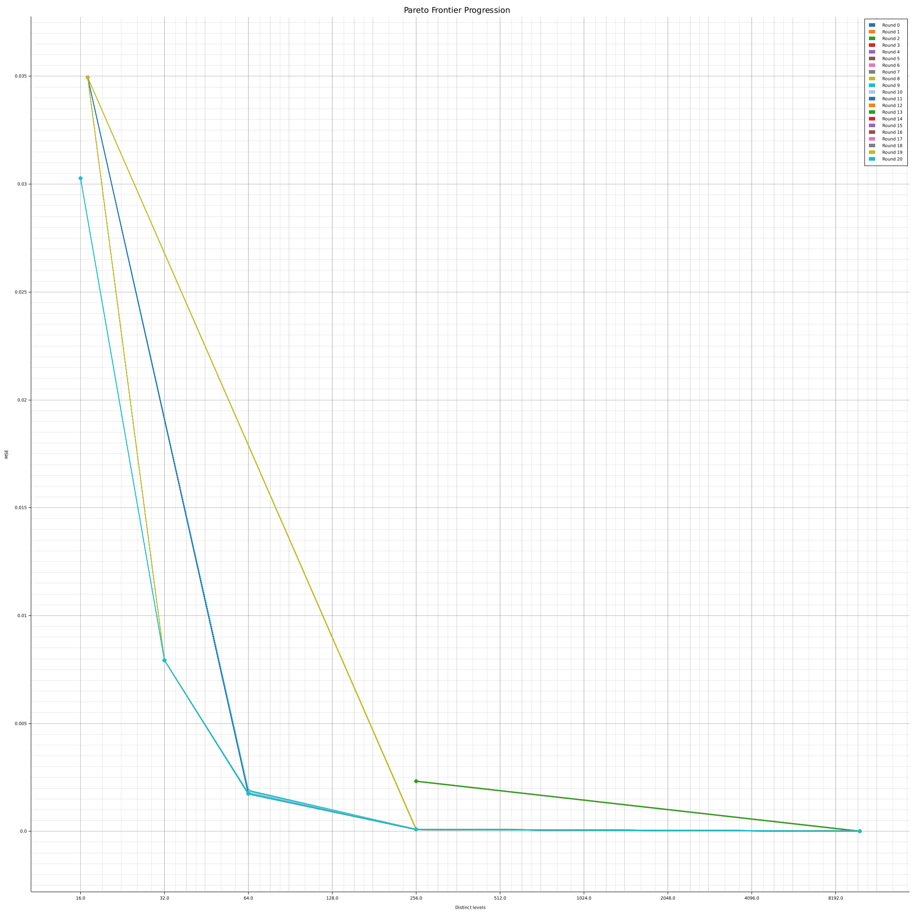

# Quantize Example

Optimal quantization via LLM-driven evolutionary search.
The LLM must implement a function that quantizes `f64` values into fewer
distinct levels, minimizing reconstruction error (MSE) while using as few
distinct output values as possible.

## How it works

1. An evolvable `quantize(input, len, output)` function starts as an identity
   copy — perfect fidelity, zero compression.
2. Each round the LLM receives the function signature, the current Pareto
   frontier (with the source code that produced each point), and the last
   attempt's result.
3. The runtime compiles the new implementation into a shared library and
   hot-swaps it in, then evaluates MSE and distinct-level count on fixed
   test data.
4. Non-dominated (num_levels, MSE) pairs are tracked on a Pareto frontier
   that grows across rounds.

The prompt is structured into clear sections (Task, Constraints, Goal,
Current Frontier, Last Attempt, Direction) so the LLM can make informed
trade-offs rather than searching blindly.

## Pareto frontier progression

The plot below shows how the frontier evolves over 20 rounds on a Laplacian
distribution with 10,000 samples. Each coloured line is the frontier snapshot
after that round. The x-axis (log2) is the number of distinct output levels;
the y-axis is MSE.



## Running

```sh
cargo run -p quantize-example
```

Requires `API_KEY`, `BASE_URL`, and `MODEL` environment variables (or a
`.env` file) for the LLM backend.
