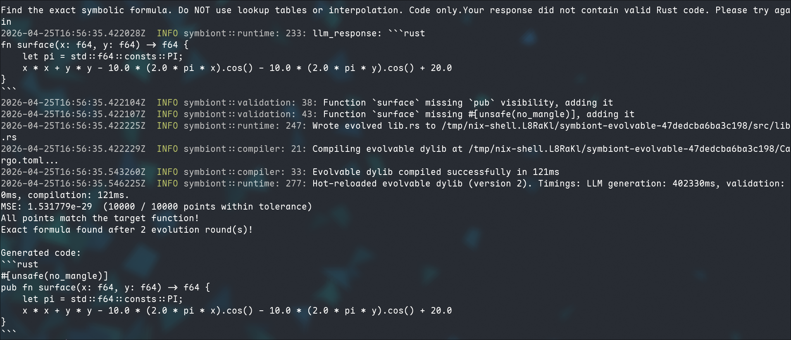

# Rastrigin — Symbolic Regression Example

This example challenges an LLM to reverse-engineer the 2-D **Rastrigin function**
purely from sample `(x, y) -> f(x, y)` data — a symbolic regression task.

The ground-truth formula is:

```
f(x, y) = 20 + x² + y² − 10·cos(2πx) − 10·cos(2πy)
```

The LLM never sees the name or formula. Each round it receives a fresh random
subset of 50 sample points drawn from a 100×100 evaluation grid over `[-5, 5]`,
along with the error report from the previous round. The constrained-generation
loop handles compilation failures automatically; the test harness feeds back
numerical errors until the MSE drops below `1e-10` — tight enough that only the
exact symbolic formula passes, not a numerical approximation.

## Running

```bash
# Requires API_KEY, BASE_URL, and MODEL env vars (or a local llama-cpp server).
cargo run -p rastrigin-example
```

## Solution

The LLM discovered the exact formula in 2 evolution rounds:


