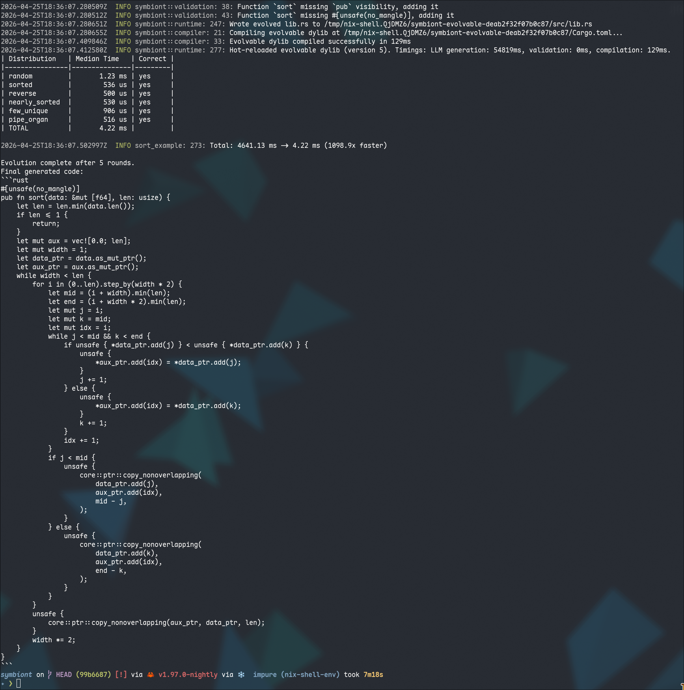

# Sort — Performance-Driven Evolution Example (1000x improvement)

This example challenges an LLM to implement and iteratively optimize a sorting
algorithm **from scratch** (no standard library sort methods allowed).

The default implementation is bubble sort — intentionally O(n²). The harness
benchmarks the evolved implementation on 10,000-element arrays across six data
distributions that expose different algorithmic weaknesses:

| Distribution   | What it punishes                                    |
|----------------|-----------------------------------------------------|
| random         | Baseline — nothing specific                         |
| sorted         | Naive quicksort with bad pivot → O(n²)              |
| reverse        | Same — bad pivot degrades to O(n²)                  |
| nearly_sorted  | Bad pivot + no insertion-sort fallback               |
| few_unique     | No 3-way partitioning → excessive swaps             |
| pipe_organ     | Tricky shape that exposes simple pivot strategies   |

Each round the LLM receives its **previous implementation** alongside
per-distribution median timings, so it can make targeted fixes rather than
rewriting from scratch.

This may be highly useful in the search for a sorting algorithm, tuned for a specific input distribution.

## Running

```bash
# Requires API_KEY, BASE_URL, and MODEL env vars (or a local llama-cpp server).
cargo run -p sort-example
```

## Solution



Here the solution contains `unsafe`, which could be prompted away or the Harness adds support for forbidding `unsafe`
in the future if this is configured in `Runtime`. See `TODO.md`.
