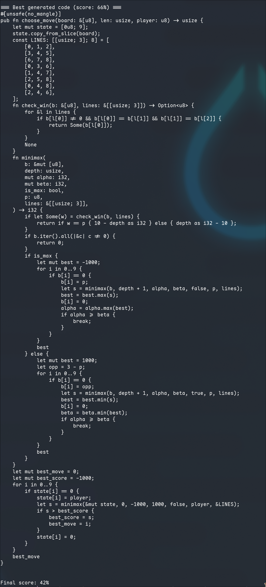

# Tic-Tac-Toe — Game AI Evolution Example

This example challenges an LLM to evolve a **strategic game-playing AI** purely through code.

An evolvable `choose_move(board: &[u8], len: usize, player: u8) -> usize` function
picks a move given a board state. The board is a 9-element slice (`0=empty, 1=X, 2=O`)
with layout:

```
 0 | 1 | 2
-----------
 3 | 4 | 5
-----------
 6 | 7 | 8
```

The default implementation picks the first empty cell — a terrible strategy.
Each round the evolved AI plays **300 games** against three opponents of increasing
strength:

| Opponent   | Strategy                                   |
|------------|--------------------------------------------|
| random     | Uniform random move                        |
| smart      | Win → block → center → corner → random     |
| minimax    | Perfect play via minimax (unbeatable)      |

Results (wins, losses, draws, forfeits) are fed back to the LLM as a formatted
table. The constrained-generation loop handles compilation errors automatically,
while `symbiont::catch_panic` catches runtime panics (e.g. out-of-bounds moves)
as forfeits — providing targeted feedback for the next generation.

This showcases symbiont's ability to evolve **strategic reasoning** through code:
the LLM must discover game-theoretic concepts like center control, fork creation,
and blocking — expressed as compiled Rust.

## Running

```bash
# Requires API_KEY, BASE_URL, and MODEL env vars (or a local llama-cpp server).
cargo run -p tictactoe-example
```

The example runs for up to 5 evolution rounds (or until score ≥ 90%).
Press `Ctrl+C` to stop early.

## Solution


